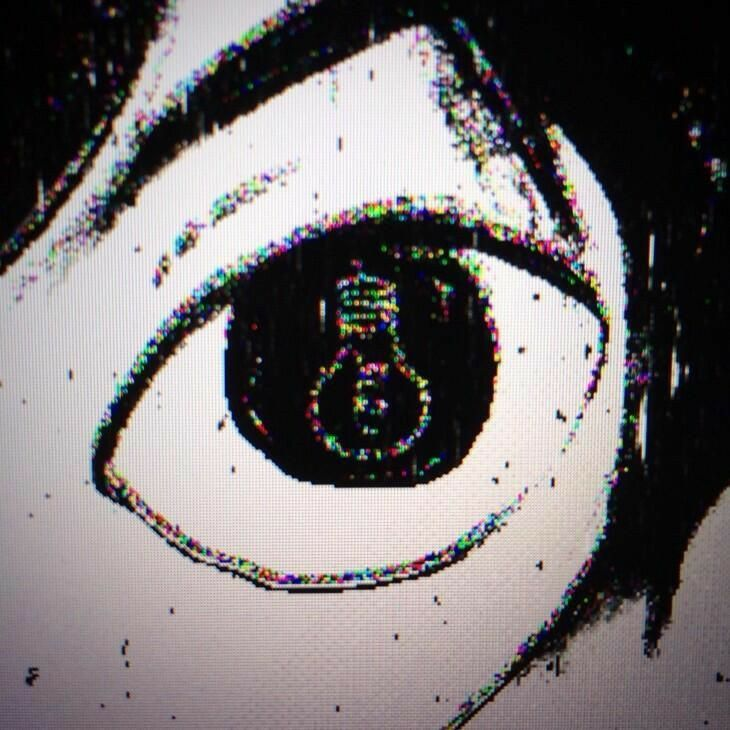
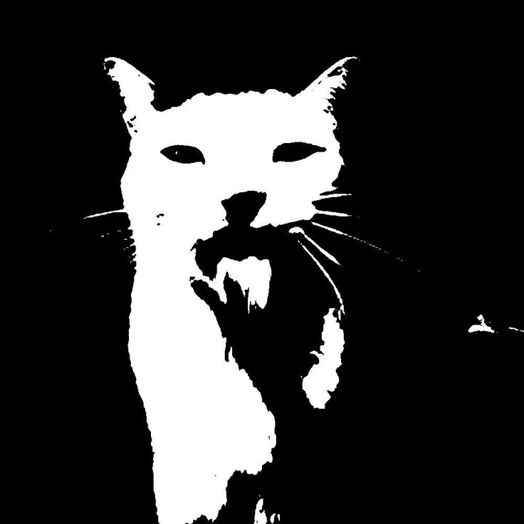

<!-- ═══════════════════════════ 幕 · BANNER ═══════════════════════════ -->

<!-- título em fonte pixel japonesa, branco -->

<!-- subtítulo typewriter -->

 

  

<!-- ═══════════════════════════ プロフィール · PROFILE ═══════════════════════════ -->
## 「プロフィール」

> **夜にコードを書く。** *yoru ni kōdo wo kaku* — "escrevo código à noite."

Dev **full-stack** na **Land IT**, atuando em vários produtos e clientes — de plataformas web e sistemas de gestão/operações a dashboards 3D, automações e **IA/LLM em produção** (agentes, integrações, MCP).

Trato cada side-project como um experimento: uma tecnologia nova pra domar. Gosto de estética monocromática, glitch e do silêncio de madrugada codando.

Do conceito ao deploy — **se não roda pro usuário, não tá pronto.**

 

<!-- ═══════════════════════════ 技術 · STACK ═══════════════════════════ -->
## 「技術」

 

 

<!-- ═══════════════════════════ 作品 · WORKS ═══════════════════════════ -->
## 「作品」

> **作りながら学ぶ。** *tsukurinagara manabu* — "aprender construindo."

| — | projeto | o que é |
|:--:|:--|:--|
| `01` | **[ecommerce-analytics-br](https://github.com/lukvilela/ecommerce-analytics-br)** | dados end-to-end (Olist) — ETL, EDA, dashboard Streamlit e modelagem Power BI |
| `02` | **[industrial-ops-analytics](https://github.com/lukvilela/industrial-ops-analytics)** | manutenção preditiva industrial — ML de previsão de falha (AUC 0.97) + simulador de risco |
| `03` | **[Akira Mangás](https://github.com/lukvilela/manga-store)** | e-commerce cyberpunk de mangás — Next.js 16, Prisma, testes Playwright |
| `04` | **[Command Center](https://github.com/lukvilela/command-center)** | um "Trello" próprio — kanban, sync de PRs do GitHub, métricas de velocity/lead time |
| `05` | **[Kanaru](https://github.com/lukvilela/kanaru)** | SaaS freemium pra aprender japonês (Next.js + Firebase) |
| `06` | **[Violino Dojo](https://github.com/lukvilela/violino-dojo)** | treinador de violino no navegador — partitura (VexFlow), afinador por microfone, XP/SRS |

> 💾 código de produção em **[@lukasvilela](https://github.com/lukasvilela)** — full-stack na Land IT em múltiplos produtos e clientes: plataformas web, sistemas de gestão e operações, dashboards 3D, automações e agentes/MCP · repos privados.

<!-- ═══════════════════════════ 統計 · STATS ═══════════════════════════ -->
## 「統計」

<!-- ═══════════════════════════ 音楽 · SOUNDTRACK ═══════════════════════════ -->
## 「音楽」

> **静寂の中で。** *seijaku no naka de* — "em meio ao silêncio."

<!-- Spotify "tocando agora" — troque 31q3r4hh2ixq2raa32h5wgstk3pi após o setup (rodapé) -->

 

<!-- ═══════════════════════════ 終 · FOOTER ═══════════════════════════ -->

<!--
════════════════════════════════════════════════════════════════
  COMO PUBLICAR:
  1) Crie o repo  lukvilela/lukvilela  (mesmo nome do usuário).
  2) Suba ESTE README.md + a pasta  assets/  (com as 4 imagens).
     -> os caminhos "assets/xxx.jpg" resolvem sozinhos no perfil.
  3) SPOTIFY: https://spotify-github-profile.kittinanx.com -> login ->
     copie sua URL -> troque "31q3r4hh2ixq2raa32h5wgstk3pi" no bloco 音楽.

  Títulos JP: プロフィール perfil · 技術 skills · 作品 obras ·
              統計 stats · 音楽 música · 終 fim
════════════════════════════════════════════════════════════════
-->
